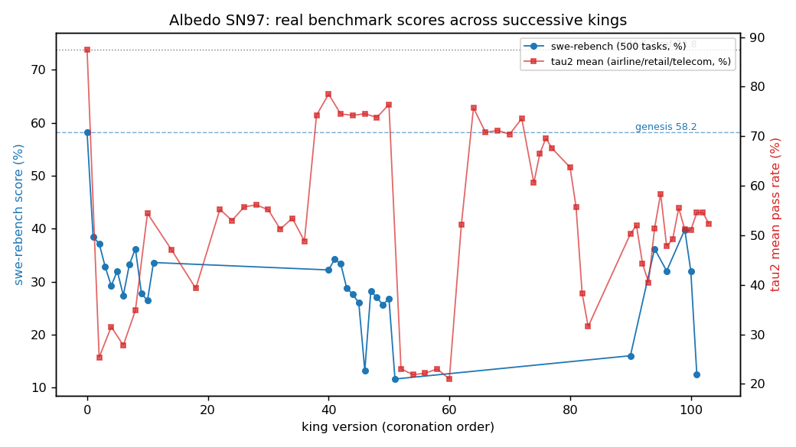
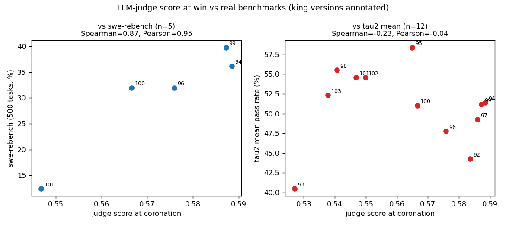

# E-BASELINE: LLM-judge duel score vs real benchmarks (Albedo SN97)

**Date**: 2026-08-02. **Data**: `data/albedo/{albedo_dash,albedo_scores,albedo_bench}.json`.
**Script**: `scripts/judge_baseline.py`. **Numbers**: `baseline.json`.

## Setup

Each duel scores challenger and king in [0,1] via a GLM-5.2 checklist judge; challenger is
coronated when `win_margin >= 0.03`. Real benchmarks: 500-task swe-rebench (`albedo_scores.json`,
percent; genesis 58.2, GLM-5.2 ref 73.8) and tau2 airline/retail/telecom pass rates plus a
110-task swe-rebench subset (`albedo_bench.json`, per-king `latest_scores`).

**Data constraint**: `eval_runs` retains only the last 200 duels (2026-07-23 → 2026-08-02), so
judge-score-at-coronation exists only for king versions 92–103 (12 coronations, mean win margin
0.040). Kings map to versions via roman numerals (king-XCIX = 99); genesis = 0.

## Correlations: judge score at coronation vs benchmark

| Benchmark | n | Spearman (p) | Pearson (p) |
|---|---|---|---|
| swe-rebench 500-task | 5 | 0.87 (0.054) | 0.95 (0.015) |
| swe-rebench 110-task subset | 12 | 0.31 (0.32) | 0.25 (0.42) |
| tau2 mean (3 domains) | 12 | **-0.23 (0.48)** | **-0.04 (0.89)** |
| tau2 airline | 12 | 0.04 (0.89) | 0.01 (0.99) |
| tau2 retail | 12 | 0.17 (0.60) | 0.30 (0.34) |
| tau2 telecom | 12 | -0.36 (0.24) | -0.32 (0.31) |

Using instead each king's mean judge score across all duels it defended: vs swe-rebench 500-task
Spearman 0.46 (n=5, p=0.43); vs tau2 mean Spearman -0.34 (n=13, p=0.25).

Caveat: the n=5 swe-rebench-500 correlation is positive, but it covers a 0.55–0.59 judge-score
sliver of late kings and is dominated by the king-CI collapse (12.4). Across the denser n=12
samples the judge score carries no usable signal (all |r| ≤ 0.36, all p ≥ 0.24).

## Benchmark trajectory over successive kings

| Series | n | slope/king | Spearman vs order (p) |
|---|---|---|---|
| swe-rebench 500-task incl. genesis | 30 | -0.090 pts | -0.45 (0.014) |
| swe-rebench 500-task kings only | 29 | -0.059 pts | -0.39 (0.039) |
| tau2 mean kings only | 55 | +0.0008 | 0.05 (0.74) |

Genesis scores 58.2; **every one of the 29 benchmarked kings is below genesis** (best 39.8,
king XCIX; worst 11.6, king LI). 100+ generations of judge-selected "improvements" produced a
net swe-rebench loss of ~20–46 points. Tau2 oscillates wildly (0.13–0.78) with no trend.

## Dethronement transitions (consecutive king_n → king_{n+1})

| Benchmark | transitions | improved | worsened | unchanged |
|---|---|---|---|---|
| swe-rebench 500-task | 24 | 7 (29%) | 17 (71%) | 0 |
| tau2 mean | 19 | 8 (42%) | 10 (53%) | 1 |
| swe-rebench 110-task subset | 43 | 9 | 7 | 27 (mostly 0.0→0.0) |

By construction the judge declared the challenger better in 100% of these transitions
(margin ≥ 0.03), yet swe-rebench improved in only 29% — worse than a coin flip. Mean
swe-rebench delta per dethronement: -3.0 points.

## Takeaway

The judge score is a Goodharted target: it deterministically ratifies dethronements while the
real benchmark declines in 71% of them, and at the king level it has no significant correlation
with tau2 or the 110-task swe-rebench subset (n=12). **Baseline for a replacement score: beat
Spearman ≈ 0.3 (n=12) against held-out benchmarks and >29% benchmark-improving dethronements.**

## Plots

